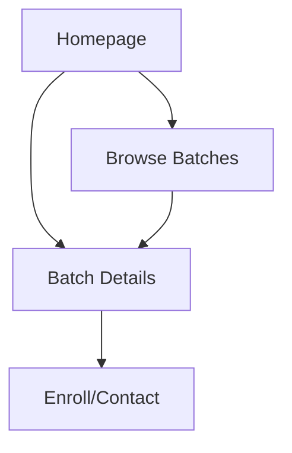

## 1. Product Overview
A minimalist educational platform website where students can browse and view Physics Wallah batches. The platform provides a clean, modern interface to showcase available courses and batches with an emphasis on simplicity and user experience.

Students can discover educational content through an intuitive homepage with hero section and feature explanations, making it easy to find relevant Physics Wallah batches for their learning needs.

## 2. Core Features

### 2.1 User Roles
| Role | Registration Method | Core Permissions |
|------|---------------------|------------------|
| Visitor | No registration required | Browse homepage, view batch information |
| Student | Email registration | Access detailed batch content, save favorites |

### 2.2 Feature Module
Our Physics Wallah platform consists of the following main pages:
1. **Homepage**: hero section, navigation, feature sections, batch showcase
2. **Batch Details**: detailed batch information, curriculum, instructor details
3. **Browse Batches**: filter and search functionality, batch listings

### 2.3 Page Details
| Page Name | Module Name | Feature description |
|-----------|-------------|---------------------|
| Homepage | Hero Section | Display compelling headline, subheading, and call-to-action button with minimalist design |
| Homepage | Navigation Bar | Clean navigation with logo and menu items, sticky on scroll |
| Homepage | Features Section | Showcase platform benefits with icon cards and brief descriptions |
| Homepage | Batch Preview | Display featured batches in card format with images and key details |
| Homepage | Footer | Minimal footer with contact information and social links |
| Batch Details | Batch Header | Show batch title, instructor name, duration, and enrollment status |
| Batch Details | Curriculum | List topics covered in expandable sections |
| Batch Details | Instructor Info | Display instructor credentials and experience |
| Browse Batches | Search Bar | Allow users to search batches by name or topic |
| Browse Batches | Filter Options | Filter by subject, difficulty level, duration, and price |
| Browse Batches | Batch Grid | Responsive grid layout showing all available batches |

## 3. Core Process
Users arrive at the homepage and are greeted with a clean hero section explaining the platform's value proposition. They can scroll through feature sections to understand the benefits, then explore featured batches. Users can click on any batch to view detailed information or use the browse page to filter and search through all available batches.

## 4. User Interface Design

### 4.1 Design Style
- **Primary Colors**: Deep blue (#1e40af) and white (#ffffff)
- **Secondary Colors**: Light gray (#f3f4f6) and accent orange (#f97316)
- **Button Style**: Rounded corners with subtle shadows, hover effects
- **Typography**: Clean sans-serif fonts (Inter preferred), 16px base size
- **Layout Style**: Card-based design with generous whitespace
- **Icons**: Minimal line icons, consistent stroke width

### 4.2 Page Design Overview
| Page Name | Module Name | UI Elements |
|-----------|-------------|-------------|
| Homepage | Hero Section | Full-width gradient background, centered white text, prominent CTA button with hover animation |
| Homepage | Features Section | Three-column grid on desktop, single column mobile, icon cards with 8px border radius |
| Homepage | Batch Preview | Horizontal scroll on mobile, 3-column grid desktop, card shadows on hover |
| Batch Details | Header | Hero image with overlay text, enrollment badge, instructor avatar |
| Browse Batches | Filter Sidebar | Collapsible filter panel, checkbox selections, clear filters button |

### 4.3 Responsiveness
Desktop-first design approach with mobile adaptation. Breakpoints at 768px and 1024px. Touch-optimized interactions with appropriate tap targets and swipe gestures for mobile users.