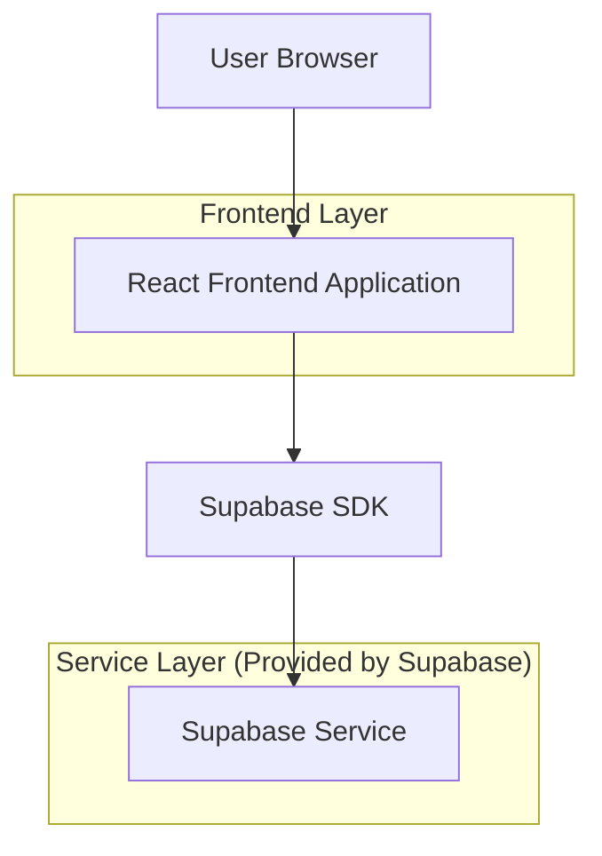
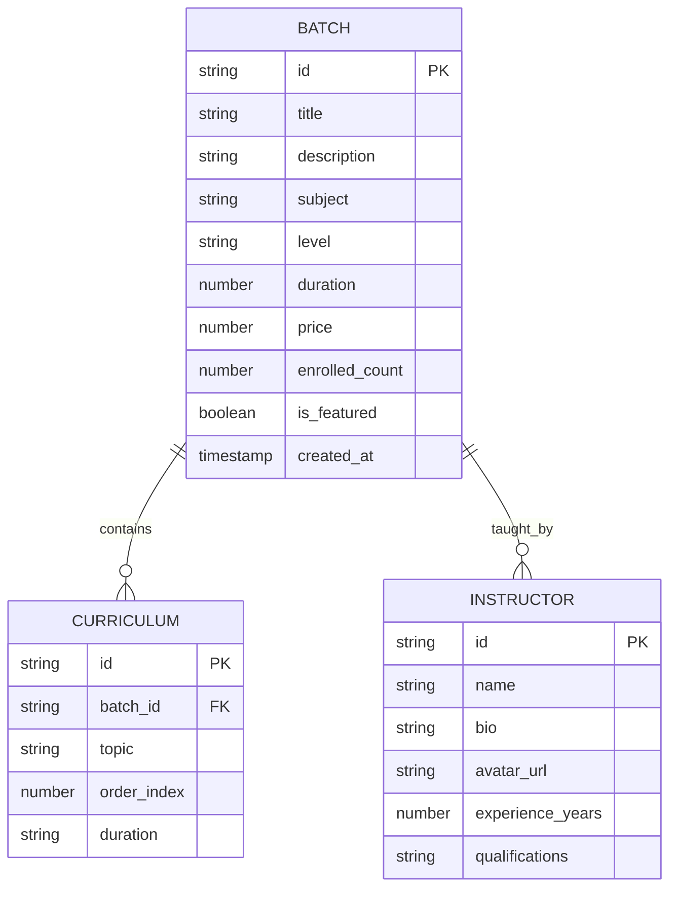

## 1. Architecture design



## 2. Technology Description
- Frontend: React@18 + tailwindcss@3 + vite
- Initialization Tool: vite-init
- Backend: Supabase

## 3. Route definitions
| Route | Purpose |
|-------|---------|
| / | Homepage with hero section and feature showcase |
| /batches | Browse all available batches with filtering |
| /batch/:id | Detailed view of specific batch with curriculum |

## 4. API definitions

### 4.1 Batch Management APIs

Get all batches
```
GET /api/batches
```

Request:
| Param Name | Param Type | isRequired | Description |
|------------|------------|------------|-------------|
| subject | string | false | Filter by subject (Physics, Chemistry, Math) |
| level | string | false | Filter by difficulty level (Beginner, Intermediate, Advanced) |
| duration | number | false | Filter by duration in weeks |

Response:
| Param Name | Param Type | Description |
|------------|------------|-------------|
| batches | array | Array of batch objects |
| total | number | Total number of batches |

Example
```json
{
  "batches": [
    {
      "id": "batch-123",
      "title": "Physics Foundation",
      "instructor": "Alakh Pandey",
      "subject": "Physics",
      "level": "Beginner",
      "duration": 12,
      "price": 2999,
      "enrolled": 15420
    }
  ],
  "total": 45
}
```

Get batch details
```
GET /api/batches/:id
```

Response:
| Param Name | Param Type | Description |
|------------|------------|-------------|
| batch | object | Complete batch details with curriculum |

## 5. Data model

### 5.1 Data model definition


### 5.2 Data Definition Language
Batch Table (batches)
```sql
-- create table
CREATE TABLE batches (
    id UUID PRIMARY KEY DEFAULT gen_random_uuid(),
    title VARCHAR(255) NOT NULL,
    description TEXT,
    subject VARCHAR(50) NOT NULL,
    level VARCHAR(20) NOT NULL CHECK (level IN ('Beginner', 'Intermediate', 'Advanced')),
    duration INTEGER NOT NULL,
    price DECIMAL(10,2) NOT NULL,
    enrolled_count INTEGER DEFAULT 0,
    is_featured BOOLEAN DEFAULT false,
    instructor_id UUID REFERENCES instructors(id),
    created_at TIMESTAMP WITH TIME ZONE DEFAULT NOW(),
    updated_at TIMESTAMP WITH TIME ZONE DEFAULT NOW()
);

-- create indexes
CREATE INDEX idx_batches_subject ON batches(subject);
CREATE INDEX idx_batches_level ON batches(level);
CREATE INDEX idx_batches_featured ON batches(is_featured);
CREATE INDEX idx_batches_created_at ON batches(created_at DESC);

-- grant permissions
GRANT SELECT ON batches TO anon;
GRANT ALL PRIVILEGES ON batches TO authenticated;
```

Curriculum Table (curriculum_items)
```sql
-- create table
CREATE TABLE curriculum_items (
    id UUID PRIMARY KEY DEFAULT gen_random_uuid(),
    batch_id UUID NOT NULL REFERENCES batches(id),
    topic VARCHAR(255) NOT NULL,
    order_index INTEGER NOT NULL,
    duration VARCHAR(50),
    created_at TIMESTAMP WITH TIME ZONE DEFAULT NOW()
);

-- create indexes
CREATE INDEX idx_curriculum_batch_id ON curriculum_items(batch_id);
CREATE INDEX idx_curriculum_order ON curriculum_items(order_index);

-- grant permissions
GRANT SELECT ON curriculum_items TO anon;
GRANT ALL PRIVILEGES ON curriculum_items TO authenticated;
```

Instructor Table (instructors)
```sql
-- create table
CREATE TABLE instructors (
    id UUID PRIMARY KEY DEFAULT gen_random_uuid(),
    name VARCHAR(255) NOT NULL,
    bio TEXT,
    avatar_url VARCHAR(500),
    experience_years INTEGER,
    qualifications TEXT,
    created_at TIMESTAMP WITH TIME ZONE DEFAULT NOW()
);

-- create indexes
CREATE INDEX idx_instructors_name ON instructors(name);

-- grant permissions
GRANT SELECT ON instructors TO anon;
GRANT ALL PRIVILEGES ON instructors TO authenticated;
```